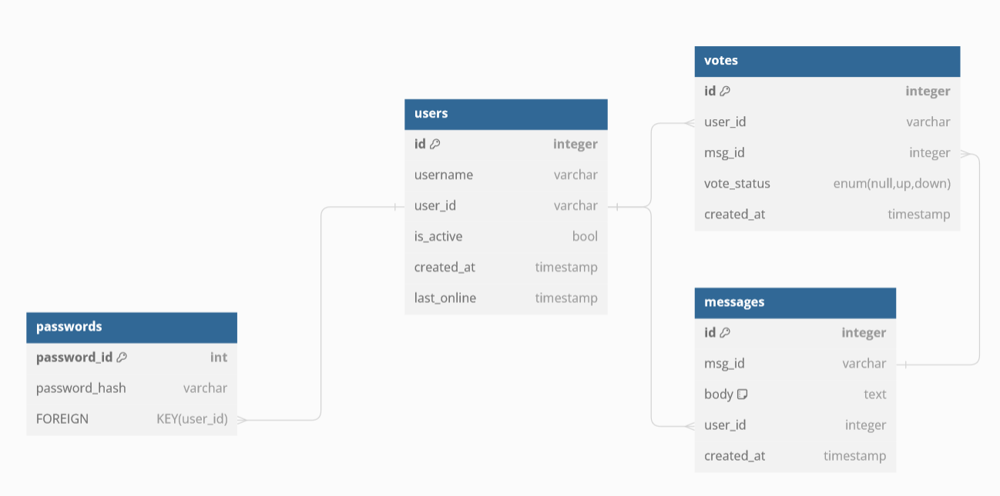

Hello,

<b> Introduction </b>

I have build a fullstack app consisting of a typescript react fronted, connected to a Go backend. A websocket connection allows for high throughput live chat. Users may create accounts, or for testing, may log in with username `DemoUser` and password `password`. Each user's password is securely hashed and salted before being stored in a Postgresql data server. 

While testing, I encourage you to log many active users at once. The chatroom is limited by default to 100 active users. Deployment instructions are below. I reccomend using kubernetes for seamless deployment.

Video notes:
the time is incorrect because I am running the instance on my windows computer, which has a different interface than the linux docker time. the time will show up correctly in the kubernetes deployment.

<b>Deployment Notes</b>

The docker deployment uses a non-dockerized postgres server, and the kubernetes deployment uses a dockerized postgres server. In general, you should not dockerize Postgres servers as the memory volumes for docker are non-permanent. If you wanted to deploy to production, you should use a managed server like azure postgres or GCP postgres as it will have built in redundancy and backups, as well as the ability to be shared by functionally unlimited kubernetes pods.

<b>Kubernetes Deployment</b>

Please note that you CANNOT have any other service occupying port 8080.

To deploy the kubernetes, first start minikube:

`minikube start`

Ensure you are in the root directory, then run:

`kubectl apply -f go-server.yaml`

`kubectl get pods`

you should see a pod id, which you now need to forward its port.

`kubectl port-forward YOUR-POD-NAME 8080:8080`

Now you can visit [loalhost:8080](http://localhost:8080/) to see the chatroom deployed via kubernetes.

<b>Local Docker Deployment:</b>

The docker images for this project are hosted publically on dockerhub due to file size constraints. they will be removed as soon as I receive feedback on this project. If you wish to build the images yourself, you can find the dockerfile for the go server in `/backend` and the dockerfile for the postgres server in `/postgres docker`

First, ensure that you have postgres downloaded and configured to run on default port 5432. you will need to know your username and password. 

Next, run
`docker image pull DOCKER IMAGE`

To run the dockerfile, you will need your database username, and password. Additionally, the server builds and connects with `testdb` on postgres, but you may change that as an environmental variable.

`docker run -p 8080:8080 -e DB_USERNAME=postgres -e DB_PASSWORD=password -e DB_HOST=host.docker.internal DOCKERIMAGE:v6`

then visit `YOUR_LOCAL_IP:8080`
for me it is: http://192.168.0.180:8080/ 
but yours will be diffent. On windows, you can find this ip with `ipconfig` in powershell. It will be your IPv4.

<b> Bare metal Deployment</b>

Please ensure that you have the postgres server running as described in the docker section.

navigate to backend folder, then run

`go run main.go`

visit localhost:8080 to see the website.

https://dbdiagram.io/d/65c6b006ac844320aed729dd

Postgres Notes:
When you install, make sure you pay attention to what your username and password are
to log into postgres ctl, 
`psql -U username -h localhost`

to see list of databases available, 
`\l` or `\list`

to select a specific database, 
`\c dbname`

to see the tables in the database
`\dt`
